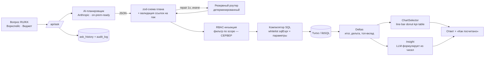

# ARCHITECTURE — SANA

## Пайплайн ответа

## Почему LLM НЕ пишет SQL
LLM выбирает только `id` метрик/измерений из семантического слоя и возвращает строгий JSON-план.
Компилятор (`lib/engine/compiler.ts`) собирает SQL **исключительно** из whitelist-фрагментов пака
(`metric.sqlExpr`, `dimension.sqlExpr`, `pack.joins`). Значения фильтров всегда идут **параметрами**
(`?`), пользовательский текст никогда не интерполируется в SQL. Инъекция невозможна by design
(тесты: `tests/compiler.test.ts`, `tests/rbac.test.ts`).

## Данные в контуре
Расчёт делает ваша БД (Turso/libSQL, self-host ready). LLM получает только модель метрик, текст
вопроса и уже посчитанные агрегаты для вывода — **не сырые строки**. AI-адаптер
(`lib/ai/provider.ts`) абстрагирует провайдера: `anthropic` или детерминированный резервный режим;
on-prem-модель подключается заменой адаптера.

## Семантический слой (сердце)
`lib/semantic/types.ts` — `Pack { factTable, joins, metrics, dimensions, synonyms,
sampleQuestions, rbacDimension }`. Три пака (`packs/auto|retail|bank.ts`) на одном ядре.

## RBAC
`lib/engine/rbac.ts` `applyRbac()` — сервер добавляет фильтр по `scope` ПОСЛЕ планирования и
удаляет любой пользовательский фильтр по rbac-измерению: содержимым вопроса scope не обойти.

## Путь к проду заказчика
1. Описать `Pack` по схеме витрины заказчика (метрики/измерения/синонимы) — см. ADD_NEW_PACK.md.
2. Источник данных — read-replica / OLAP заказчика (тот же `@libsql/client` или адаптер).
3. Self-host: Next.js + Turso/libSQL в контуре; AI-адаптер → on-prem-модель.
4. RBAC маппится на реальные роли; AuditLog — в корпоративный SIEM.
